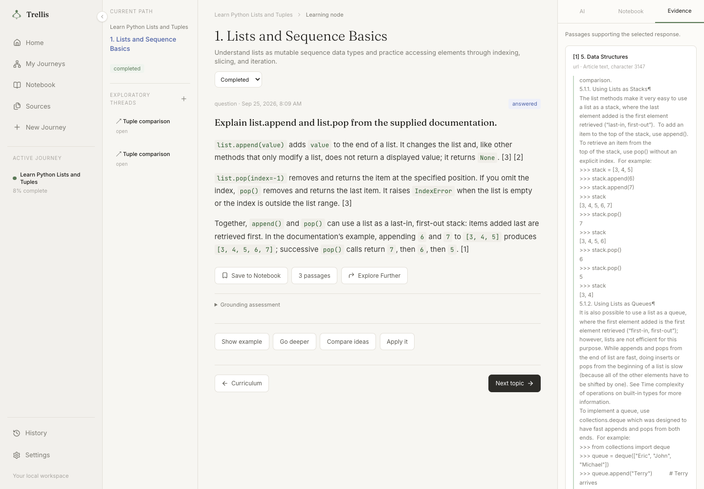

# Trellis

## An AI-Powered Learning Engine

> Learn as a connected journey, not a collection of conversations.

## Run locally

Trellis is a single-person local application. The UI, API, database, uploaded material, and exported PDFs run on your laptop. AI calls use your selected provider; web evidence requires internet access. There is no login, hosted service, or deployment setup.

Prerequisites: Docker Desktop, Python 3.12 with [uv](https://docs.astral.sh/uv/), and Node.js 22 with pnpm.

1. Keep your existing `.env`, or copy `.env.example` to `.env` and fill in a chat provider and an embedding provider.
2. Run `make setup` to install locked dependencies, start PostgreSQL, and apply migrations.
3. Run `make dev`.
4. Open **http://localhost:3100**. The API is at **http://localhost:8100/api**, with interactive documentation at **http://localhost:8100/docs**.

For the complete application in Docker instead, run `make up`, then open the same UI address. You only need Docker Desktop for this option. `make down` stops the application without deleting its database volume. Stop `make dev` before starting the Docker application because they use the same ports.

The database is PostgreSQL 17 with pgvector, published only on `127.0.0.1:55432`. Its dedicated volume is `trellis_trellis-db`. Files and PDFs live in `.data/`, which is excluded from Git. The development and Docker modes use the same database volume and data directory. Do not run `docker compose down -v` unless you intend to delete the learning database.

## Using the workspace

1. **New Journey:** enter a learning goal or paste an existing outline. Optionally select indexed sources from the source library.
2. **Sources:** upload PDF, Markdown, or text files; paste material; or add a public URL. Attach material to a journey, or leave it unattached for selection when creating one. Indexing status, errors, excerpts, and reindex controls are visible.
3. **Curriculum:** review the graph or list, edit titles/descriptions and parent relationships, add nodes, and reorder them. Nodes with learning history cannot be deleted. A journey retains at least one node.
4. **Learning node:** request an introduction, ask questions, or use the example/deeper/comparison/application actions. Each node has its own stored history. Completion is learner-controlled; beginning a primary-node interaction sets an unstarted node to in progress.
5. **Exploratory threads:** explore from a node or response, close/reopen the thread, and return to the original node. Thread messages do not change primary-node messages or completion.
6. **Notebook:** each learning journey owns one notebook, reused across visits. Save supported responses or source excerpts, add personal notes, and organize them into named sections. A section is a growing collection of related notes, not a fixed-size sheet. Choose a section explicitly or create one while saving; original learning context and source excerpts remain attached. Notes can move between sections of the same notebook, and selections/exports stay within its journey. Rejected answers cannot be saved as teaching content, but their sources and your personal notes can be saved.
7. **Study review:** select and order notebook material, save the selection, and export a PDF. Only the selected items are included, and physical page breaks are added automatically. History and Home show the last studied topic or thread; browsing the curriculum preserves that study location.

## AI providers and evidence

Settings supports **Azure OpenAI, OpenAI, OpenRouter, and Ollama**. Set credentials and endpoint defaults in the server `.env`, restart the API, then select the provider/model in Settings and test the connection. Credentials are never returned to the UI. Models must support structured JSON output.

| Provider | Server configuration |
| --- | --- |
| Azure OpenAI | `AZURE_OPENAI_ENDPOINT`, `AZURE_OPENAI_API_KEY`, `AZURE_OPENAI_API_VERSION`, `AZURE_OPENAI_MODEL` (the deployment name) |
| OpenAI | `OPENAI_API_KEY`, `OPENAI_MODEL`; optional `OPENAI_BASE_URL` |
| OpenRouter | `OPENROUTER_API_KEY`, `OPENROUTER_MODEL`; optional `OPENROUTER_BASE_URL` |
| Ollama | Optional `OLLAMA_BASE_URL` and `OLLAMA_MODEL`; install/pull the chosen model in Ollama first |

The configured Azure deployment names are used exactly as supplied. Selecting a chat provider does not discard saved content or change the embedding model. Leave `OLLAMA_BASE_URL` unset for the standard local Ollama service: native mode uses `http://localhost:11434/v1`, and Docker uses `http://host.docker.internal:11434/v1`. An explicit `.env` URL overrides the default. In Docker it must be reachable from the container; for a custom laptop port, use a URL such as `http://host.docker.internal:11435/v1`. `localhost` inside a container refers to that container. After changing `.env` in Docker, run `docker compose --profile app up -d --wait` to recreate the backend with the new setting.

Embeddings are configured independently with `EMBEDDING_PROVIDER`, `EMBEDDING_MODEL`, and `EMBEDDING_DIMENSIONS`. Azure defaults to `AZURE_OPENAI_EMBEDDING_DEPLOYMENT` and `AZURE_OPENAI_EMBEDDING_DIMENSIONS`. For Ollama embeddings, set the model and its actual dimension (for example, `nomic-embed-text` and `768`). After changing the embedding configuration, reindex existing sources in Sources. Vectors from different configured profiles are never compared. The initial local corpus uses exact pgvector cosine search; it does not need an approximate vector index.

Supplied files and URLs are searched first. When no suitable supplied evidence exists, Trellis uses DDGS to discover web pages, fetches their actual content, and indexes readable text. Search-result snippets are not treated as evidence. If supplied material cannot answer a question, web evidence may supplement it; the answer displays warnings when preferred sources are unavailable or need reindexing. Every displayed answer block must cite a retrieved excerpt; citation membership and a separate model evaluation check relevance, completeness, consistency, and grounding. A draft that fails grounding gets one correction attempt using the same evidence, followed by a fresh check at the same thresholds. Unsupported output, unavailable evidence, and failed evaluation produce a short, actionable abstention. These checks reduce unsupported output; they cannot guarantee factual correctness or source quality.

New goal-based curricula also retain per-topic evidence references and a source-support assessment. Outline imports are checked for fidelity to the supplied topics and hierarchy. The original curriculum, source excerpts, assessment, model, and timestamp remain inspectable after learner edits. Older journeys without recorded generation evidence are labelled accordingly.

PDF uploads need extractable text (OCR for scanned documents is not included). Files and downloads are limited to 20 MB and extracted source text to 500,000 characters. URL ingestion reads the provided page, not an entire website. Pages requiring login, JavaScript-only pages, and some sites that block automated readers may fail; upload the readable material or use another source. Source processing uses FastAPI background tasks with persisted status and restart recovery. Small PDF exports run synchronously; Redis/Celery are unnecessary for this supported local workflow.

## Verification and code orientation

- `make test`: PostgreSQL-backed backend tests, Python lint, and frontend type checking. Tests create and remove isolated schemas; they do not clear learner data.
- `make build`: production frontend build.
- `cd trellis-ui && pnpm exec playwright install chromium && pnpm test:e2e`: browser regressions against a running UI on port 3100. Intercepted API tests verify UI behavior independently of external models.
- `backend/.venv/bin/python scripts/verify_live.py`: real source ingestion, curriculum, Azure/provider answer/evaluation, isolated thread, notebook, saved selection, and PDF checks against the running API. It creates a retained demonstration journey and incurs provider usage. Use `--path-id ID` to reuse its journey on later runs.
- `cd backend && .venv/bin/alembic upgrade head`: apply schema changes. `alembic check` verifies model/migration alignment.

See the [completion audit](docs/completion-audit.md) for every identified gap and its fix mapped to the requirements. The [architecture and reading guide](docs/architecture.md) explains the actual request paths, library choices, and state boundaries; [verification results](docs/verification.md) records checked scenarios and remaining limits. The agreed API contract is in [build-contract.md](docs/build-contract.md).

## Current UI



Trellis is a structured, context-preserving, and persistent learning environment. It turns a learning goal into a navigable curriculum, gives the learner a focused AI-assisted workspace for each topic, and keeps progress, exploration, evidence, and useful study material connected across sessions.

## Why Trellis exists

Conversational AI is good at explaining individual concepts, but long learning journeys can become fragmented. Related questions can pull a conversation away from its main topic, progress is difficult to resume, and useful explanations are rarely organized into a learner-owned study system.

Trellis addresses this by organizing learning around a curriculum structure instead of a single chat:

```text
Learning goal
      |
      v
Structured learning path
      |
      v
Active learning node
      |
      +--> Scoped AI interaction
      |
      +--> Exploratory thread
      |
      v
Persistent progress, evidence, and study material
```

## What Trellis provides

- **Structured learning paths** - Turn a goal, topic, or supplied curriculum into topics, subtopics, and learning nodes.
- **Node-based learning** - Give every topic its own focused learning environment and context.
- **Context-preserving exploration** - Follow related concepts in independent threads without changing the primary learning path.
- **Evidence-aware assistance** - Associate generated learning content with relevant sources and expose grounding and quality signals.
- **Persistent learning state** - Preserve progress, history, active location, and session state so the learner can continue later.
- **Learner-owned knowledge** - Save explanations, examples, source excerpts, and personal notes in a structured notebook.
- **Study-session export** - Organize selected material and export it as a readable PDF.

Trellis is intended to be more than an AI tutor. Its purpose is to manage the structure, context, progression, and accumulated study material of the learning process.

## Explicit non-goals

Trellis is not currently intended to be:

- A conventional LMS or course marketplace.
- A generic ChatGPT clone.
- A fully autonomous mastery-based education platform.
- A replacement for teachers or academic institutions.
- A system that guarantees factual correctness merely because content has citations.
- A project claiming statistically proven improvement in educational outcomes without a separate study.

The first objective is to demonstrate the technical and functional feasibility of a structured, persistent, context-preserving AI learning environment.
