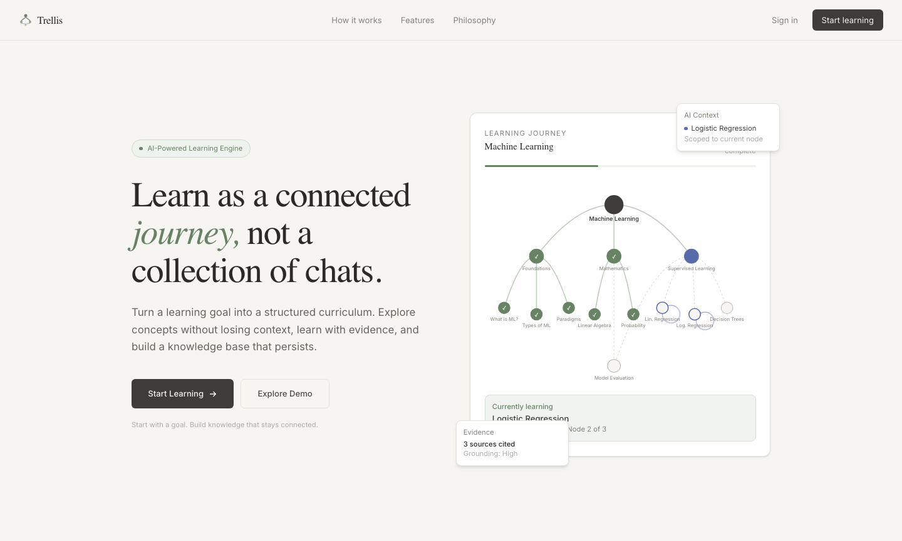
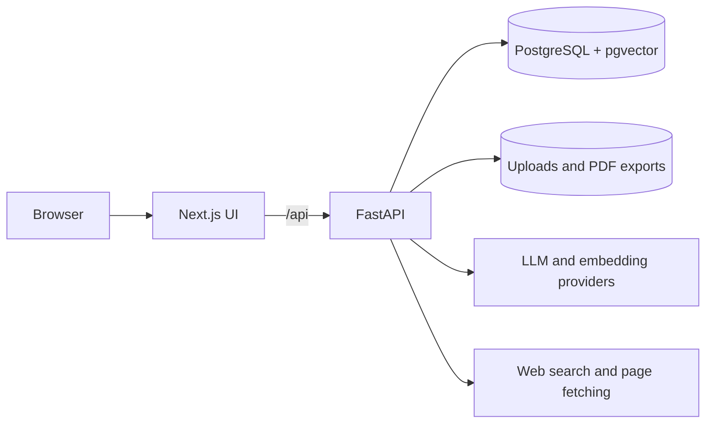

# Trellis — AI-Powered Learning Workspace

## Project Overview

Trellis turns a learning goal or syllabus into a structured journey with focused AI tutoring, evidence, and notes.

Long learning conversations are hard to organize and resume. Trellis keeps topics, questions, sources, and progress connected so learners can build on earlier work.

## Key Features

- **Learning paths:** Generate topics and subtopics from a goal, or import a supplied curriculum while preserving its hierarchy and original input.
- **Honest planning fallback:** When sources cannot support detailed curriculum claims for a broad goal, save a labelled learning outline with neutral topic descriptions; teaching answers still undergo evidence checks.
- **Graph and outline:** Explore the path visually or browse every topic in a list.
- **Focused tutoring:** Ask questions within a topic; use separate exploratory threads for related detours.
- **Persistent state:** Resume the last study location and track progress across journeys.
- **Source-backed answers:** Search attached material first, inspect cited excerpts, and use fetched web pages when more evidence is needed.
- **GitHub source links:** A repository URL reads its default-branch README, including its headings and resource lists. Linked articles are separate sources.
- **Answer review:** Check citations and grounding, attempt one correction when needed, and withhold unsupported answers. General-knowledge answers are labelled unverified.
- **Notebook and export:** Save notes and source-linked material in journey notebooks, then export selected items as a PDF.

## System Architecture

The UI calls the backend through a same-origin API. PostgreSQL stores learning state and searchable vectors; local files hold uploads and exports. [Architecture details](docs/architecture.md).

## How It Works

1. **Build a path:** Plan a hierarchy from the goal or preserve the structure of an imported syllabus. Save the original request and generation record.
2. **Scope a question:** Load only the active topic or exploratory thread's context and search relevant, attached source passages.
3. **Generate with evidence:** Retrieve stored passages, fetch web pages when needed, and generate cited answer blocks. If evidence is unavailable, an allowed general-knowledge answer is labelled unverified.
4. **Review the answer:** Validate citation IDs and assess grounding. Correct once and recheck if needed; withhold answers that remain unsupported.
5. **Keep learning:** Save interactions, progress, sources, and notebook material so the journey can be resumed.

You can delete a journey from **My Journeys** after confirming what will be removed. Its learning history, notebook, and exports are deleted; sources you added return to the source library.

## Technical Architecture / Engineering Decisions

- **FastAPI and SQLModel** keep API contracts and persistence close to the learning workflow. Source indexing runs as recoverable background work in the local API process.
- **PostgreSQL + pgvector** store both application state and source embeddings; retrieval filters vectors by embedding profile.
- **Scoped context** isolates topic and exploratory-thread histories so unrelated conversations do not leak into an answer.
- **Provider abstraction** supports Azure OpenAI, OpenAI, OpenRouter, and Ollama. Evidence review improves the acceptance gate at a latency and token cost.

## Tech Stack

| Layer                      | Technologies                                                |
| -------------------------- | ----------------------------------------------------------- |
| Frontend                   | Next.js, React, TypeScript, TanStack Query, React Flow      |
| Backend                    | Python, FastAPI, SQLModel, Alembic                          |
| AI and retrieval           | OpenAI SDK, provider-selected models, pgvector, DDGS, HTTPX |
| Storage and infrastructure | PostgreSQL, local file storage, Docker Compose              |

## Evaluation

A versioned benchmark has **96 cases across six categories**, split evenly between development and test. It compares Trellis with a one-pass RAG baseline using the same model and embeddings, fixed evidence passages, and a DeepEval model judge. On **39 mutually scored test pairs**, Trellis's mean answer-correctness judge score was **0.905 vs. 0.636**, or **42% higher** relative to the baseline.

This is a **model-judged score, not a measured factual-accuracy rate**. References were AI-authored, fixed passages replaced live web search, and the single run has not been independently calibrated against human judgments. [Evaluation method](docs/evaluation.md) · [Full results](evaluation/results/v1-initial.md).

## Performance / Results

| Test-split measure                            | One-pass RAG | Trellis |
| --------------------------------------------- | -----------: | ------: |
| Mean correctness judge score, 39 paired cases |        0.636 |   0.905 |
| Model-judged citation precision               |        95.1% |   98.6% |
| Initial retrieval recall@8, 36 cases          |        86.1% |   88.9% |
| Median answer latency                         |       3.98 s |  9.93 s |
| Product tokens used                           |       75,799 | 233,680 |

Higher answer scores came with more model calls, latency, and token use. Monetary cost was not measured.
